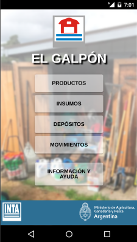

# El Galpón

El Galpón es una aplicación utilitaria para tablets, pc y smartphones que permite organizar y gestionar insumos de producción agrícola, llevar el control de stock y movimientos.

### Próximamente, disponible en [Google Play!](https://play.google.com/store/apps/details?id=com.inta.elgalpon)  

   

## Backlog versión 1.0.0 (alpha)  

  [x] Listado de movimientos.  
  [x] Listado de notificaciones.  
  [x] Modificar CATEGORIES para no usar options2Select(). 
  [x] Vista de devolucion de envases. 
  [ ] Productos con distintas presentaciones (ver nuevo modelo).  
  [ ] Agregar presentacion a productos creados.  
  [ ] En formulario de movimientos, elegir presentacion de operacion.
  [ ] Detalles de ubicacion en fila expandible.  
  [ ] Logica de operaciones.  
  [ ] Configuración de notificaciones en compra de items.  
  [ ] Lógica de alertas.
  [ ] Filtros de listados (con URL).  
  [ ] Exportar informacion excel y pdf.  