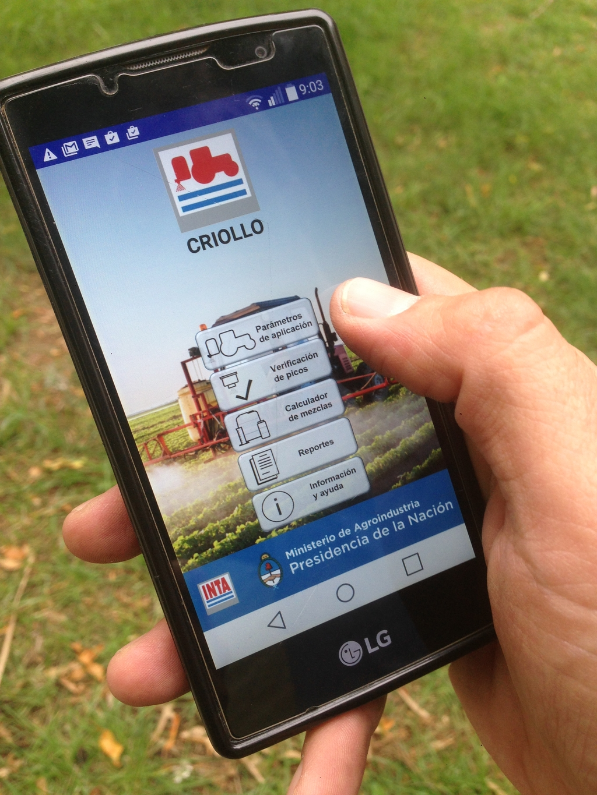

# El Galpón

El Galpón es una aplicación utilitaria para tablets, pc y smartphones que permite organizar y gestionar insumos de producción agrícola, llevar el control de stock y movimientos.

### Próximamente, disponible en [Google Play!](https://play.google.com/store/apps/details?id=com.inta.elgalpon)  

   

### Version 1.0 [1] (alpha)
  - Boilerplate React 18 + MUI + Capacitor.  
  - Menu de utilidades.  
  - Vistas.  
  - Context GUI (modals, toasts, prompts).  
  - Compilación web.  