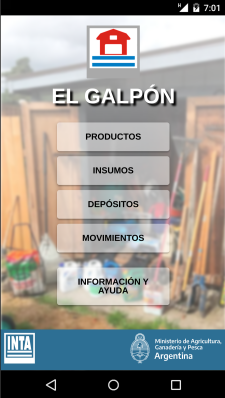

# El Galpón

El Galpón es una aplicación utilitaria para tablets, pc y smartphones que permite organizar y gestionar insumos de producción agrícola, llevar el control de stock y movimientos.

### Próximamente, disponible en [Google Play!](https://play.google.com/store/apps/details?id=com.inta.elgalpon)  


   


# Documentación

## Stack

Detalle completo de versiones en [package.json](package.json)

| Funcionalidad | Librería |
|---|---|
| Desarrollo | Vite |
| Componentes GUI | React |
| Hojas de estilos | MUI |
| Componentes nativos | Capacitor |
| Formateo de fechas | MomentJS |
| Creación de documentos pdf | PDFMake |
| Soporte multilenguaje | i18next |


## Estructura del proyecto

Generado con```tree -L 3 -I "node_modules|android|doc|tests" > project_tree.txt```

```plaintext
├── capacitor.config.json
├── images --> Contiene imágenes generales del proyecto
│   ├── background
│   │   └── galpon1.png
│   ├── captura.png
│   ├── capturas
│   │   ├── 10_info.png
│   │   ├── 11_notificaciones.png
│   │   ├── 1_menu_ppal.png
│   │   ├── 2_depositos.png
│   │   ├── 3_form_deposito.png
│   │   ├── 4_insumos.png
│   │   ├── 5_filtros_lista.png
│   │   ├── 5_form_producto.png
│   │   ├── 6_lista_productos_1.png
│   │   ├── 7_lista_productos_2.png
│   │   ├── 8_historial.png
│   │   └── 9_form_compra.png
│   ├── criollo.jpg
│   ├── favicon.png
│   ├── icon_1024.png
│   └── templates
│       ├── barn.png
│       └── campero.png
├── index.html 
├── package.json
├── package-lock.json
├── project_tree.txt
├── readme.md
├── schema.md --> Formato de la base de datos
├── src
│   ├── App.jsx
│   ├── assets --> Mayormente para imagenes de la app, pero puede incluir otros recursos
│   │   ├── backgrounds
│   │   ├── icons
│   │   ├── logo_el_galpon.png
│   │   ├── logo_inta.png
│   │   ├── logo_inta_white.png
│   │   ├── logo_ministerio_white.png
│   │   └── working_monkey.jpg
│   ├── components --> Componentes funcionales React reutilizables
│   │   ├── ActionsBlock
│   │   ├── Confirm
│   │   ├── ContextMenu
│   │   ├── EmptyList
│   │   ├── ErrorBoundary
│   │   ├── GenericCard
│   │   ├── Inputs
│   │   ├── MainView --> Este componente es el mas importante ya que agrupa todo el contenido de cada vista
│   │   ├── NotificationIcon
│   │   ├── Preloader
│   │   ├── Prompt
│   │   ├── SearchForm
│   │   └── Toast
│   ├── context --> Proveedores globales de utilidades
│   │   ├── Database
│   │   └── UIFeedback
│   ├── hooks --> Facilitadores para el uso de los proveedores
│   │   ├── useConfirm
│   │   ├── usePreloader
│   │   ├── usePrompt
│   │   └── useToast
│   ├── main.jsx
│   ├── model --> Declaraciones fundamentales de la app
│   │   ├── classes.js
│   │   ├── constants.js
│   │   ├── DB
│   │   ├── pdf
│   │   ├── translations
│   │   └── utils.js
│   ├── themes
│   │   └── index.jsx
│   └── views --> Listado de componentes React que se renderizan en cada vista
│       ├── About
│       ├── AlertsList
│       ├── Empty404
│       ├── Error
│       ├── Home
│       ├── index.jsx
│       ├── OperationForm
│       ├── OperationsList
│       ├── ProductForm
│       ├── ProductsList
│       ├── Stock
│       ├── StoreForm
│       └── StoresList
├── vite.config.js
└── vite.config.web.js
```

## Esquema de la base de datos 

### Miscelánea
```js
version: 0, // Código de version de la base de datos
locale: "es", // Idioma de la aplicación
```

### Depósitos (stores)
Definen lugares en donde pueden ubicarse los insumos. Para consultar la cantidad de insumos en un depósito, se debe recorrer la lista de insumos.  
Los depositos no se pueden eliminar si tienen existencias (items).
```js
{
    id: 0, // (indexedDB -> auto increment, localStorage -> UUID)
    name: "",
    comments: "",
    contact: { // Datos de contacto
        name: "",
        phone: "",
        address: "",
        email: ""
    }, 
    lat: 0,
    lng: 0,
    created: 0,
    modified: 0
}
```

### Productos/Artículos (products)
Definen productos y sus principales características. Los productos pueden ser herbicidas, semillas, fertilizantes, materiales de construcción, insumos veterinarios y demás. Algunos productos tienen envases retornables y fecha de vencimiento. 

Los productos no se pueden eliminar si hay stock asociado.

```js
{
    id: 0, // (indexedDB -> auto increment, localStorage -> UUID)
    name: "",
    brand: "",
    comments: "",
    categories: ["Herbicidas","Fumigacion"],
    presentations:[
        {
            unit: "liter", // Keyword
            bulk: false, // Si se vende a granel
            pack_size: 20 || null // Tamanio de envase. Null si bulk===true
        }
    ]
    expirable: false,
    returnable: false,
    created: 0,
    modified: 0,
    sku: ""
}
```

### Insumos (items)
Los insumos son instancias de productos que se encuentran almacenadas en un depósito. Hay un stock de productos cerrados (o usados en fracción) y un stock de envases vacíos. Si el producto tiene fecha de vencimiento, se puede cargar.    
```js
{
    id: 0, // (indexedDB -> auto increment, localStorage -> UUID)
    product_id: 0,
    store_id: 0,
    stock: 0,
    empty_packs: 0 || null, // Si returnable = true
    presentation_index: 0,
    expiration_date: 0 || null // Si expirable = true
}
```

### Movimientos (operations)
Los movimientos tienen fechas editables pero el resto son datos inmutables, permiten llevar un registro de las operaciones sobre las cantidades de insumos en cada lugar. 
```js
{
    id: 0, // (indexedDB -> auto increment, localStorage -> UUID)
    timestamp: 0,
    type: "", // keywords: BUY, MOVE_STOCK, SPEND, MOVE_PACKS, RETURN_PACKS
    items_data: [{ // Arreglo de items por operacion
        product_id: 0,
        store_from_id: 0 || null,
        store_to_id: 0 || null,
        price: 0, // Costo de operacion (compra, movimiento o devolucion)
        stock_amount: 0, // Siempre positivo o 0
        pack_amount: 0, // Siempre positivo o 0
        presentation_index: 0, // Se puede comprar una presentacion por vez
    }]
    observations: "" // Mensaje con detalles adicionales
}
```

### Alertas (alerts)
Son mensajes que indican informacion sobre productos por vencerse o por agotarse. El tipo de alerta preconfigura el texto que se muestra en la vista, pero se puede agregar mensajes configurables que tienen mas prioridad que el defecto. El enlace redirige a una vista particular con filtros.
```js
{
    id: 0,
    timestamp: 0,
    type: "", // keywords: EXPIRATION, STOCK, OTHER -> Ver translations
    ref: "",
    message: "",
    seen: false,
    link: ""
}
```


# Compilación del proyecto

Luego de clonar repo, instalar dependencias:
```
$ npm install
```

Correr versión web para debug
```bash
$ npm run dev
```

Compilar versión web de produccion
```bash
$ npm run build
```

Generar apk (android)
```bash
$ npm run build && npx cap sync
$ export CAPACITOR_ANDROID_STUDIO_PATH="..../android-studio/bin/studio.sh"
$ npx cap open android
$ adb logcat chromium:I
```

Para inspeccionar versión mobile con Chrome, abrir:
```
chrome://inspect/#devices
```

### SDK Level
Indicar el SDK level en ```android/app/variables.gradle```
```
minSdkVersion = ...
compileSdkVersion = ...
targetSdkVersion = ...
```

### Permisos
Agregar permisos en ```android/app/src/main/AndroidManifest.xml```.

```xml
...
<aplication>
  ...
  android:requestLegacyExternalStorage="true"
  ...
  <activity>
    ...
    android:exported="true"
    ...
  </activity>
  ...
</application>

...
<uses-permission android:name="android.permission.INTERNET" />
<uses-permission android:name="android.permission.READ_EXTERNAL_STORAGE"/>
<uses-permission android:name="android.permission.WRITE_EXTERNAL_STORAGE" />
```

### Iconos, logos y splash
Definir iconos y splashcreens en ```android/app/src/main/res``` o correr:  
```bash
$ cordova-res android --skip-config --copy
```


### Actualización
Configurar valores de version y compilación en:

  - [package.json](package.json)
  - [build.gradle](app/build.gradle)
  - [.env](.env)
  - [src/model/constants](src/model/constants.js)

**Importante:** revisar lógica de migraciones de la base de datos.


# Backlog 

La rama ```main``` contiene la versión de producción. Los cambios se realizan sobre la rama ```dev```.

## versión 1.0.0 (alpha)  

En menu ppal  
[x] Letra de los botones en minuscula  
[x] Botones más anchos para ocupar una sola linea  
[x] Reemplazar Devoluciones por Devolver envases vacíos  
[x] Sacar sombra a las letras de EL GALPON  

Vista de depositos  
[x] Quitar campos de creado y modificado  
[x] Cambiar "insumos" por "stock"  
[x] Ajustar codigo de colores. Para boton stock usar negro  
[x] Que el boton de stock ocupe toda la linea superior y las 3 operaciones abajo  
[x] Deshabilitar el boton de "crear" cuando hay un deposito seleccionado  

Vista de productos  
[x] Ordenar alfabeticamente por defecto  
[x] Formato de presentaciones  

Vista de formulario de productos  
[x] Formato y cálculo de presentaciones.  
[ ] CUando el producto es retornable, no puede ser venta a granel.

Vista de stock  
[x] Ordenar alfabeticamente por defecto  
[x] Reemplazar "Comprar otro insumo" por "ingresar otro insumo"  
[x] Corregir seleccion de items (se selecciona uno diferente al clickeado).  
[x] Formato de presentaciones  
[x] Reemplazar "stock seleccionado" por "productos seleccionados"  
[x] Eliminar columna de envases vacios  
[x] Corregir botones de accion  

Vista de devoluciones  
[x] Ordenar alfabeticamente por defecto  
[x] Quitar "Comprar insumos"  
[x] Eliminar columna de stock  
[x] Corregir botones de accion  

Vista de formulario de deposito  
[x] Cambiar creacion por "nuevo deposito"  
[x] La geolocalizacion no debe ser obligatoria  

Formulario de compra/movimiento/devolucion  
[ ] Indicar fecha de vencimiento  
[ ] Campos para configurar alarma de stock bajo  
[ ] Adaptar campos segun la operacion  
[ ] Registrar operacion en la DB  

Filtrado de tablas
[ ] Selector de categoria tapa el teclado  
[x] Quitar campos fecha de - hasta  
[ ] Aplicar filtrados para las tablas  