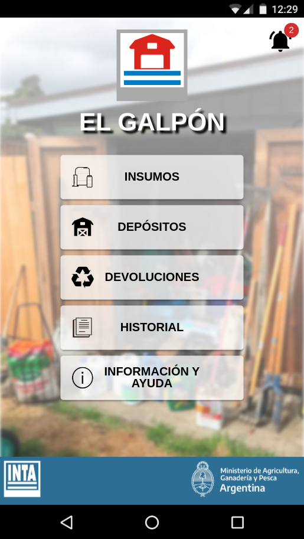

# El Galpón

El Galpón es una aplicación utilitaria para tablets, pc y smartphones que permite organizar y gestionar insumos de producción agrícola, llevar el control de stock y movimientos.

### Próximamente, disponible en [Google Play!](https://play.google.com/store/apps/details?id=com.inta.elgalpon)  

   


## Stack

| Funcionalidad | Librería |
|---|---|
| Desarrollo | Vite |
| Componentes GUI | React |
| Hojas de estilos | MUI |
| Componentes nativos | Capacitor |
| Formateo de fechas | MomentJS |
| Creación de documentos pdf | PDFMake |
| Soporte multilenguaje | i18next |


## Estructura del proyecto

Mostrar con```tree -L 3 -I "node_modules|android|doc|tests" > project_tree.txt```

```plaintext
├── capacitor.config.json
├── images --> Contiene imágenes generales del proyecto
│   ├── background
│   │   └── galpon1.png
│   ├── captura.png
│   ├── capturas
│   │   ├── 10_info.png
│   │   ├── 11_notificaciones.png
│   │   ├── 1_menu_ppal.png
│   │   ├── 2_depositos.png
│   │   ├── 3_form_deposito.png
│   │   ├── 4_insumos.png
│   │   ├── 5_filtros_lista.png
│   │   ├── 5_form_producto.png
│   │   ├── 6_lista_productos_1.png
│   │   ├── 7_lista_productos_2.png
│   │   ├── 8_historial.png
│   │   └── 9_form_compra.png
│   ├── criollo.jpg
│   ├── favicon.png
│   ├── icon_1024.png
│   └── templates
│       ├── barn.png
│       └── campero.png
├── index.html 
├── package.json
├── package-lock.json
├── project_tree.txt
├── readme.md
├── schema.md --> Formato de la base de datos
├── src
│   ├── App.jsx
│   ├── assets --> Mayormente para imagenes de la app, pero puede incluir otros recursos
│   │   ├── backgrounds
│   │   ├── icons
│   │   ├── logo_el_galpon.png
│   │   ├── logo_inta.png
│   │   ├── logo_inta_white.png
│   │   ├── logo_ministerio_white.png
│   │   └── working_monkey.jpg
│   ├── components --> Componentes funcionales React reutilizables
│   │   ├── ActionsBlock
│   │   ├── Confirm
│   │   ├── ContextMenu
│   │   ├── EmptyList
│   │   ├── ErrorBoundary
│   │   ├── GenericCard
│   │   ├── Inputs
│   │   ├── MainView --> Este componente es el mas importante ya que agrupa todo el contenido de cada vista
│   │   ├── NotificationIcon
│   │   ├── Preloader
│   │   ├── Prompt
│   │   ├── SearchForm
│   │   └── Toast
│   ├── context --> Proveedores globales de utilidades
│   │   ├── Database
│   │   └── UIFeedback
│   ├── hooks --> Facilitadores para el uso de los proveedores
│   │   ├── useConfirm
│   │   ├── usePreloader
│   │   ├── usePrompt
│   │   └── useToast
│   ├── main.jsx
│   ├── model --> Declaraciones fundamentales de la app
│   │   ├── classes.js
│   │   ├── constants.js
│   │   ├── DB
│   │   ├── pdf
│   │   ├── translations
│   │   └── utils.js
│   ├── themes
│   │   └── index.jsx
│   └── views --> Listado de componentes React que se renderizan en cada vista
│       ├── About
│       ├── AlertsList
│       ├── Empty404
│       ├── Error
│       ├── Home
│       ├── index.jsx
│       ├── OperationForm
│       ├── OperationsList
│       ├── ProductForm
│       ├── ProductsList
│       ├── Stock
│       ├── StoreForm
│       └── StoresList
├── vite.config.js
└── vite.config.web.js
```

## Compilación del proyecto


Luego de clonar repo, instalar dependencias:
```
$ npm install
```

Correr versión web para debug
```bash
$ npm run dev
```

Compilar versión web de produccion
```bash
$ npm run build
```

Generar apk (android)
```bash
$ npm run build && npx cap sync
$ export CAPACITOR_ANDROID_STUDIO_PATH="..../android-studio/bin/studio.sh"
$ npx cap open android
$ adb logcat chromium:I
```

Para inspeccionar versión mobile con Chrome, abrir:
```
chrome://inspect/#devices
```

### SDK Level
Indicar el SDK level en ```android/app/variables.gradle```
```
minSdkVersion = ...
compileSdkVersion = ...
targetSdkVersion = ...
```

### Permisos
Agregar permisos en ```android/app/src/main/AndroidManifest.xml```.

```xml
...
<aplication>
  ...
  android:requestLegacyExternalStorage="true"
  ...
  <activity>
    ...
    android:exported="true"
    ...
  </activity>
  ...
</application>

...
<uses-permission android:name="android.permission.INTERNET" />
<uses-permission android:name="android.permission.READ_EXTERNAL_STORAGE"/>
<uses-permission android:name="android.permission.WRITE_EXTERNAL_STORAGE" />
```

### Iconos, logos y splash
Definir iconos y splashcreens en ```android/app/src/main/res``` o correr:  
```bash
$ cordova-res android --skip-config --copy
```


### Actualización
Configurar valores de version en:

  - package.json
  - app/build.gradle
  - .env  <-- Fecha de compilación
  - src/model/storage  <-- Sólo migraciones DB


## Backlog versión 1.0.0 (alpha)  

  [x] Listado de movimientos.  
  [x] Listado de notificaciones.  
  [x] Modificar CATEGORIES para no usar options2Select(). 
  [x] Vista de devolucion de envases. 
  [ ] Productos con distintas presentaciones (ver nuevo modelo).  
  [ ] Agregar presentacion a productos creados.  
  [ ] En formulario de movimientos, elegir presentacion de operacion.
  [ ] Detalles de ubicacion en fila expandible.  
  [ ] Logica de operaciones.  
  [ ] Configuración de notificaciones en compra de items.  
  [ ] Lógica de alertas.
  [ ] Filtros de listados (con URL).  
  [ ] Exportar informacion excel y pdf.  